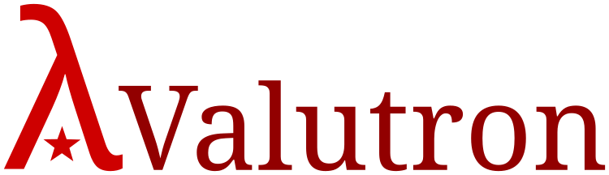

# Valutron

### Overview

**Valutron** is an experimental programming language. The name stands for
"Functional Language Built Upon The Lambda Calculus with Object-Oriented
Characteristics." The primary source of inspiration in the design of Valutron
is Scheme and Common Lisp; indeed, Valutron's design is directly based upon
that of John McCarthy's Lisp 1.5 and of Scheme. Additional inspiration has been
drawn from Apple Dylan, Smalltalk, and perhaps others.

##### Licence

**Valutron** is *copyfarleft software*. Its source code, herein defined as that
code found within this repository, is available for use under the terms of the
copyfarleft public *Peer Production Licence*; please see CPYRIGHT for further 
information.

Alternatively, Valutron's source code may be used under the terms of the
*Creative Commons Attribution-NonCommercial-ShareAlike (Scotland) Licence 2.5*;
please find these terms in full at
[creativecommons.org](https://creativecommons.org/licenses/by-nc-sa/2.5/scotland/legalcode).

### FAQs

A few frequently asked questions about **Valutron**:

> On what platforms does Valutron work?

 * FreeBSD, DragonFly BSD, NetBSD, OpenBSD, OS X
 * GNU/Linux, Musl/BusyBox/Linux
 * Solaris, OpenIndiana
 * Windows, OS/2, eComStation
